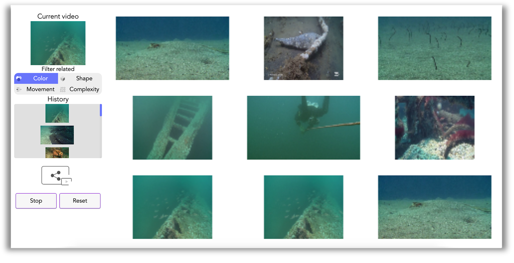
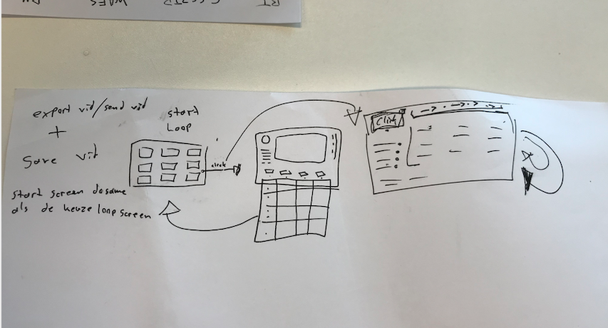
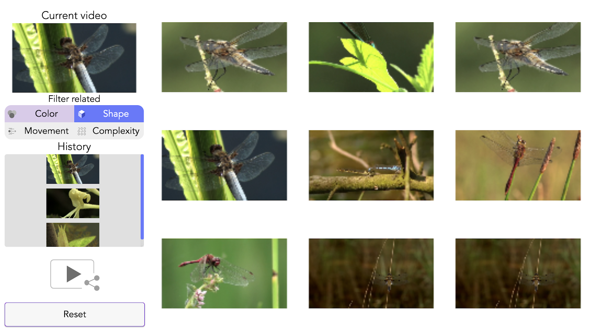

# Semia
[](https://standardjs.com)

## Installation
Run the following commands
```sh
git clone https://github.com/MartijnReeuwijk/meesterproef-semia.git
cd meesterproef-semia
npm install
touch .env
```

Next install a mysql database and add the user `semia` with a password of your choice.  
Then open the `.env` file and add the following
```
DB_HOST=localhost
DB_USER=semia
DB_PASSWORD=the_password_you_chose
DB_NAME=semia
```

To run the server either use
```sh
nodemon

# or

npm run dev

# or

node index.js
```

# Explorative interface for Semia


## Table of contents
* [Debriefing](#debriefing)
* [Our task](#our-task)
* [The users](#the-users)
* [The problem](#the-problem)
* [Solution](#solution)
  + [First version](#first-version)
<!--  + [Filter data design](#filter-data-design) -->
  + [Why Timer](#why-timer)
  + [Why 9 images](#why-9-images)
  + [Why History](#why-history)
* [Product owner feedback](#product-owner-feedback)
* [End user feedback](#end-user-feedback)
* [Data](#data)
  + [Image thumbnails](#image-thumbnails)
  + [Search results](#search-results)
  + [Openbeelden data](#openbeelden-data)
* [code](#code)
* [Sources](#sources)

## Debriefing
In a collaboration between UvA, HvA, Eye, Beeld en Geluid and Studio Louter exists research project Semia. This stands for The Sensory Moving Image Archive. They are investigating how digitized heritage collections can be explored best. By using analysis software and custom made interfaces, the content can be reused and analyzed by the users.

## Our task
Developing an interface where movie footage can be searched based on colour, shape, movement and visual complexity. The interface should enable the user to explore content from a large dataset.

## The users
The people that would use this interface are film researchers and artists. In a video shown to us by Maaike and Frank **ADD HERE**

## The problem
Semia representatives approached us and asked us to make an app with which one could navigate through the immense data set they provided. The dataset provided was extremely big and impossible to navigate through, it was simply too rich of a source to have a conventional app make use of it in a meaningful and interesting/fun way.

Until now there was only one way to browse films, which is based on metadata. We were tasked to create an interface based on sensory data.

## Solution
After a brainstorm session Tim had a genius moment and came up with a concept inspired by [this scene](https://www.youtube.com/watch?v=04He1qcAgv8&feature=youtu.be&t=48) from Blade_Runner 2049. In our field we call moments of genuine inspiration like these “epic gamer moments”, and this was definitely one. <!-- this was tim's idea -->

The result was a first iteration of the app where a user was presented a number of images in rapid succession making it possible to view the hige dataset in a reasonable amount of time.
Great but it didn’t work all too great without user input. Quickly it was decided that the loop-time of the images needed to be adjusted to a more reasonable time fitting to the actions the user would be able to perform. An interval of five seconds was decided on thinking this would be enough time for the user to be able to regard the shots and make a pick (we later found out that no it wasn’t enough time but that was later and we were living in the now which is now the past and now we know better). After brainstorming the first version Tim made a short animation explaining the flow and interaction in the app. The animation was pitched and well received by the product owners so we started building the final product.

When then proceeded to create a [project board on the github repo](https://github.com/MartijnReeuwijk/meesterproef-semia/projects/1) which contained all the to do's.

### First version

In week two we made the first clickable version

We made an application which is used to navigate through a film database in an explorative manner. It is targeted towards researchers and artists working with film. The application allows the user to view shots related to one another based on color, movement within the shot, shapes recognised in each shot and the visual complexity of each shot. The user is able to put together a path of frames relating to one another in many interesting ways, creating link where previously there weren't any.



<!-- ### Filter data design
(Vertel hier over de 2 versies waar we aan hadden gedacht de 100% breed en de 50%)
Iemand moet het hierr aanvullen want ik dacht dat we het juist onder elkaar zouden doen want dan ziet het er uit alsof het is verbonden met de current-slection img… maar das weer werk.
We decided to give the filter a rounded border because I’m not really sure and would have given it no border and would have put the buttons directly under the current selected image and vertically aligned them under each other to seperate them better. But the team decided that was a bad idea so we did the rounded border anyways. It does save space now which is definitely nice seeing as the control panel can look quite crowded. -->

### Why Timer
Our application makes use of the huge dataset and we wanted to make/allow the user to navigate through it in a way where they have input but are generally served what the application/data suggests. The user can only “search” by choosing a shot they’d like to see more of/are interested in. We chose to have an app where you could loop through the data at a speed that would allow the user to view just how vast the data is and actually have them interact. To do this we thought it would be best to have the data loop at an interval, make the user view the data at a speed that makes it possible to absorb the data in a second and then serve them more. In the first iteration we had the interval every five seconds which fires a large number of stimuli at the user. Users found the five second interval too short and were very overwhelmed by the fact that they had to view all images in that time and make a choice. So we douled the time and added an animation so the images don’t flash the whole time, making it more pleasant to use and preventing giving the users a sense of urgency.

### Why 9 images
We chose to display nine shots for two reasons, maximum meaningful observable amount per loop and screen ratios.
The first reason we chose to display the shots 9 at a time is based on a test we conducted with our target audience and a few peers. After testing the app we received feedback on the timer, filter and the grid of shots. We asked the test subjects whether the number of shots being displayed where too many, too few or just right. Most users didn’t question the amount and found the relation between the amount of time for each loop/set to be good and should the time between each loop increase that the number of shots should do so too. We decided to keep the number of shots and the duration of the timer because we still wanted to keep the element of interacting with an interface that allows the user to interact with the data in an overseeable manner without overwhelming the user. Nine shots is not a large number that would overwhelm the user and isn’t a small amount that bores the user and makes them want to skip the iteration.
The second reason is based on research we conducted on our target audience, after checking with our product owners and testing with the target audience we found out that we’d be designing for desktop screens and could assume that 100% of our users would be desktop users. Therefore we sought a ratio where we could show the videos in a format that would support the best use case for desktop users we found out that  as of 2016, most computer monitors use widescreen displays with an aspect ratio of 16:9. A lot of the historical film data we were working with had different screen dimensions seeing as they came from a time where screens use to hold dimensions closer to a 4:3 or a 5:4 ratio. We chose to apply the 16:9 ratio on the container and fitted the shots in there as big as possible (without stretching). This gave confirmed our grid of 3 by 3 where the width of the shots is greater than the height given modern dimension standards.

### Why History
From the start we thought it would be interesting if we could display the path a user had traversed to reach the current selection and which filters where applied to reach that result. This could be interesting because we had imagined that the users would then be able to scroll back in their path and not only see which selections they had made but also be able to select a previously selected video and change the “future” path by making different choices/clicking different shots. In practice displaying which filters had been applied in the path proved to be not only extremely difficult to achieve but also impossible within the time we had. We decided to implement the core of the path in the app to allow the users to create a timeline because how you got to your current destination is also interesting/even more interesting than simply showing the result, seeing as thats what the entire dataset is about.

## Product owner feedback
In the creation process of this app we worked closely to the product owner and the Eye Amsterdam. Every week we had a meeting and a test session with the owners. This made sure we are always on the right track with the product and if the created designs make any sense at all. In the days between the meeting we worked on features for the app or improve upon existing features.

Working in these “sprints” and having these meetings will always keep the owners in the loop so they don't get surprised at the end of the product. They always know what they are going to get in the end.

## End user feedback
In the fourth week of the project we went to the Eye data collection center where we did five end user tests and the results were all different but very useful. We had five people come over from all different professions. After this feedback we went and improved upon the features or UX they wanted to see change.  
We created a project board containing all the things we had to improve according to the tests and arranged the to do's using the MOSCOW method. The board can be found [here](https://github.com/MartijnReeuwijk/meesterproef-semia/projects/2).

## Data
We got access to a few different data sources which could all be used together to make the semia app. The data is a about 300.000 linked imaged by a Google AI. We got the results of the matching and connected them to the imaged we had received. By linking the 2 data sets together we are able the acces the Openbeelden api using the selected ID and receive more data about this image.

### Image thumbnails
The first one is a 1.9GB large `.zip` file full of image thumbnails. From the names of the images we constructed an array to be able to load them into the application and get 9 random images from.

<details>
<summary>A short array of image numbers</summary>

```json
[1000452,1000836,1000986,1001004,1001158,1001176,1001466,1001487,1001533,1001563,1001741,1001766,1001894,1001921]
```
</details>

### Search results
The second bit of data were the search results. These contain information about the frames that are related to one another.

<details>
<summary>Search result for a shot/video</summary>

```json
{
 "vid_id": "1001004",
 "shot_id": "1001004_107",
 "results": {
   "colour": ["1023301_107", "1001004_109", "1023301_109", "1023301_91", "1001004_91", "1001004_98", "1023301_98", "1001004_76", "1023301_76", "1001004_102", "1023301_102", "1001004_119", "1023301_119", "1001004_25", "1023301_25", "1023301_94", "1001004_94", "1001004_50", "1023301_50", "1023301_96", "1001004_96", "1023301_84", "1001004_84", "1023301_69", "1001004_69", "1023301_131", "1001004_131", "1001004_121", "1023301_121", "1023301_133", "1001004_133", "1001004_123", "1023301_123", "1001004_71", "1023301_71", "1001004_129", "1023301_129", "1023301_74", "1001004_74", "1001004_86", "1023301_86", "1023301_158", "1001004_158", "1023301_15", "1001004_15", "1001004_171", "1023301_171", "1001004_23", "1023301_23", "1023301_111"],
   "shape": ["1023301_107", "1023301_158", "1001004_158", "1023301_121", "1001004_121", "1023301_10", "1001004_10", "1001004_133", "1023301_133", "1001004_127", "1023301_127", "1001004_25", "1023301_25", "1001004_94", "1023301_94", "1023301_109", "1001004_109", "1023301_144", "1001004_144", "1001004_23", "1023301_23", "1001004_48", "1023301_48", "1023301_86", "1001004_86", "1001004_150", "1023301_150", "1001004_179", "1023301_179", "1001004_115", "1023301_115", "1001004_0", "1023301_0", "1001004_137", "1023301_137", "1001004_129", "1023301_129", "1001004_119", "1023301_119", "1023301_6", "1001004_6", "1023301_29", "1001004_29", "1001004_31", "1023301_31", "1023301_141", "1001004_141", "1001004_8", "1023301_8", "1001004_169"],
   "movement": ["1001004_107", "1033549_1", "1038860_0", "83433_8", "84215_8", "1055650_6", "1061450_7", "1033821_0", "1029787_2", "1023301_105", "1001004_105", "1024581_6", "84117_8", "745037_4", "165568_6", "1041781_0", "693622_14", "627868_22", "1023078_2", "1023682_2", "1027038_35", "953679_10", "1001004_23", "1023301_23", "84117_260", "1066864_12", "657685_2", "1042876_1", "1023078_6", "1001004_76", "1023301_76", "1068976_7", "1046758_2", "125768_7", "1070838_33", "84117_37", "1046796_3", "1027752_2", "745052_3", "815442_0", "82707_84", "750803_3", "1024210_25", "2778_13", "171577_16", "693622_46", "158497_5", "137699_0", "1035980_0", "1043318_2"],
   "clutter": ["1023301_107", "1039375_4", "162344_11", "652369_3", "98168_22", "1042876_1", "20540_8", "1001004_3", "1023301_3", "685502_15", "717673_0", "43244_11", "682058_11", "47315_14", "631177_25", "957054_11", "97944_11", "95682_9", "719197_0", "976376_53", "1128066_72", "62755_3", "687235_45", "83433_376", "54918_58", "654336_0", "815014_4", "802651_16", "688483_11", "14918_9", "127787_4", "678541_15", "1128121_7", "16586_6", "653991_16", "97996_12", "687259_30", "679539_8", "17655_21", "59894_11", "764167_6", "27585_12", "651069_21", "32425_1", "650224_9", "687361_3", "1127414_23", "1001563_2", "1023927_2", "43281_17"]

}
```
</details>

### Openbeelden data
The last data bit is from the openbeelden.nl API. Using the `vid_id` from the search results we can request more information about the video.

<details>
<summary>A response from the openbeelden API</summary>

```json
{
 "OAI-PMH": {
   "responseDate": "2019-05-27T13:27:34Z",
   "request": {
     "_identifier": "oai:openimages.eu:1000452",
     "_metadataPrefix": "oai_dc",
     "_verb": "GetRecord",
     "__text": "https://openbeelden.nl/feeds/oai/?verb=GetRecord&amp;identifier=oai:openimages.eu:1000452&amp;metadataPrefix=oai_dc"
   },
   "GetRecord": {
     "record": {
       "header": {
         "identifier": "oai:openimages.eu:1000452",
         "datestamp": "2017-04-20T00:01:20Z",
         "setSpec": "vpro"
       },
       "metadata": {
         "dc": {
           "title": {
             "_xml:lang": "en",
             "__prefix": "dc",
             "__text": "Space pioneer Rick Tumlinson on colonizing space"
           },
           "creator": {
             "_xml:lang": "en",
             "__prefix": "dc",
             "__text": "VPRO"
           },
           "subject": [{
               "_xml:lang": "en",
               "__prefix": "dc",
               "__text": "Space"
             },

               "_xml:lang": "en",
               "__prefix": "dc",
               "__text": "Space exploration"
             },

               "_xml:lang": "en",
               "__prefix": "dc",
               "__text": "Planets"
             },

               "_xml:lang": "en",
               "__prefix": "dc",
               "__text": "Colonization"
             },

               "_xml:lang": "en",
               "__prefix": "dc",
               "__text": "Human settlements"
             },

               "_xml:lang": "en",
               "__prefix": "dc",
               "__text": "Space technology"
             },

               "_xml:lang": "en",
               "__prefix": "dc",
               "__text": "Space sciences"
             },

               "_xml:lang": "en",
               "__prefix": "dc",
               "__text": "Asteroid mining"
             },

               "_xml:lang": "en",
               "__prefix": "dc",
               "__text": "Dreamer"
             },

               "_xml:lang": "en",
               "__prefix": "dc",
               "__text": "Future society"

           ],
           "description": {
             "_xml:lang": "en",
             "__prefix": "dc",
             "__text": "Rick Tumlinson on colonizing space and our future work and life on other planets."
           },
           "publisher": [{
               "_xml:lang": "en",
               "__prefix": "dc",
               "__text": "VPRO"
             },

               "__prefix": "dc",
               "__text": "https://www.openbeelden.nl/users/vpro"

           ],
           "contributor": {
             "__prefix": "dc",
             "__text": "Rick Tumlinson"
           },
           "date": {
             "__prefix": "dc",
             "__text": "2016-10-02"
           },
           "type": {
             "__prefix": "dc",
             "__text": "Moving Image"
           },
           "format": [{
               "__prefix": "dc",
               "__text": "https://openbeelden.nl/files/10/00/1000467.1000456.Rick_Tumlinson.mp4"
             },

               "__prefix": "dc",
               "__text": "https://openbeelden.nl/files/10/00/1000469.1000456.Rick_Tumlinson.mp4"
             },

               "__prefix": "dc",
               "__text": "https://openbeelden.nl/files/10/00/1000456.Rick_Tumlinson.mp4"
             },

               "__prefix": "dc",
               "__text": "https://openbeelden.nl/files/10/00/1000471.1000456.Rick_Tumlinson.webm"
             },

               "__prefix": "dc",
               "__text": "https://openbeelden.nl/files/10/00/1000473.1000456.Rick_Tumlinson.ogv"
             },

               "__prefix": "dc",
               "__text": "https://openbeelden.nl/files/10/00/1000475.1000456.Rick_Tumlinson.ogv"
             },

               "__prefix": "dc",
               "__text": "https://openbeelden.nl/files/10/00/1000490.1000456.Rick_Tumlinson.m3u8"
             },

               "__prefix": "dc",
               "__text": "https://openbeelden.nl/images/1000502/Space_pioneer_Rick_Tumlinson_on_colonizing_space_%2837_56%29.png"

           ],
           "identifier": {
             "__prefix": "dc"
           },
           "source": {
             "_xml:lang": "en",
             "__prefix": "dc"
           },
           "relation": {
             "_xml:lang": "en",
             "__prefix": "dc"
           },
           "mediator": {
             "_xml:lang": "en",
             "__prefix": "dc"
           },
           "language": {
             "__prefix": "dc",
             "__text": "en"
           },
           "coverage": {
             "_xml:lang": "en",
             "__prefix": "dc",
             "__text": "Auston, US"
           },
           "rights": {
             "__prefix": "dc",
             "__text": "https://creativecommons.org/licenses/by-sa/3.0/nl/"
           },
           "_xmlns:xsi": "http://www.w3.org/2001/XMLSchema-instance",
           "_xmlns:dc": "http://purl.org/dc/elements/1.1/",
           "_xmlns:oai_dc": "http://www.openarchives.org/OAI/2.0/oai_dc/",
           "_xsi:schemaLocation": "http://www.openarchives.org/OAI/2.0/oai_dc/ http://www.openarchives.org/OAI/2.0/oai_dc.xsd",
           "__prefix": "oai_dc"


   },
   "_xmlns:xsi": "http://www.w3.org/2001/XMLSchema-instance",
   "_xmlns": "http://www.openarchives.org/OAI/2.0/",
   "_xsi:schemaLocation": "http://www.openarchives.org/OAI/2.0/ http://www.openarchives.org/OAI/2.0/OAI-PMH.xsd"

}
```
</details>

## code
<details>
<summary>File structure of the project</summary>

```
root
|
| - partials/
|   |
|   | - cronJobs.js
|   | - data.js
|   | - db.js
|   | - openbeelden.js
|   | - setupdb.js
|
| - static/
|   |
|   | - css/
|       | - attribute.css
|       | - clock.css
|       | - footer.css
|       | - keyframes.css
|       | - master.css
|       | - nav.css
|       | - overlay.css
|       | - share.css
|   | - images/
|       | - icons/
|       | - logo/
|       | - socials/
|       | - thumbnails/
|   | - js/
|       | - partials/
|       | - detail.js
|       | - filter.js
|       | - history.js
|       | - index.js
|       | - intro.js
|       | - manifest.json
|       | - share.js
|   | - semia_data/
|       | - SEMIA_seach_results.json
|   | - array.json
|   | - sw-register.js
|   | - worker.js
|
| - views/
|   |
|   | - partials/
|   | - detail.ejs
|   | - error.ejs
|   | - index.ejs
|   | - offline.ejs
|   | - search.ejs
|
| - .env
| - config.json
| - index.js
```
</details>

For the image loading, we first render 9 images server side. After every 10 seconds the front-end sends a request to the back-end requesting 9 new images.

When the user goes to the second page the server renders 9 related images. After every 10 seconds the front-end sends a request to the server requesting all the related images so it can pick 9 random but related images. It also enables the front-end to filter on color, shape movement and visual complexity.

## Sources
Epic gamer moment
- Foli, T. D. (ter perse). Pro-gamer moments and what they mean. https://www.Wikepedia.org/epic%20gamer&20moments%20and%20what%20they%20mean

“For researchers and artists alike the true treasure isn’t the end result but the friends we made along the way”
- Captain Jack
